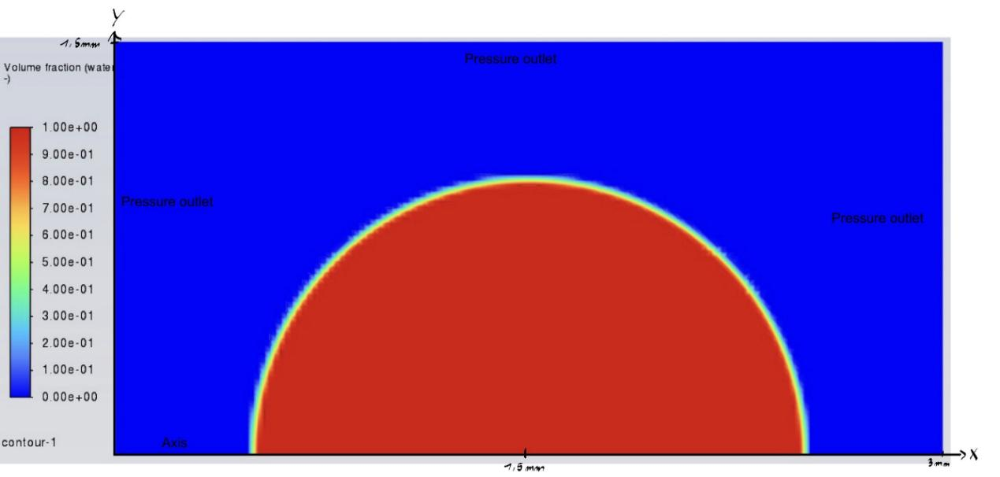
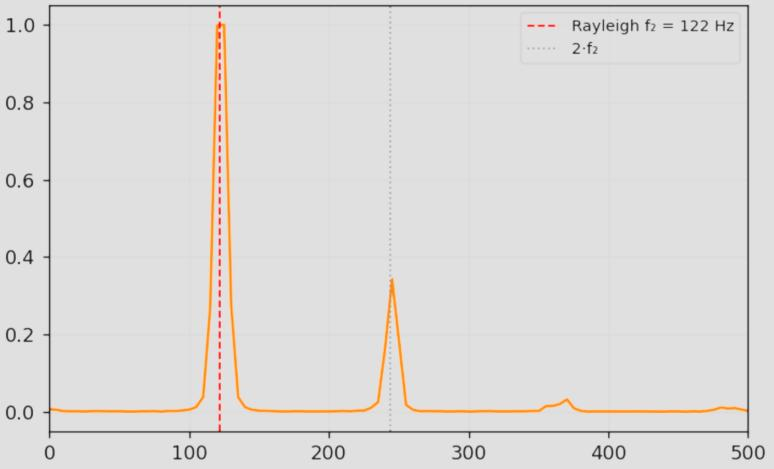
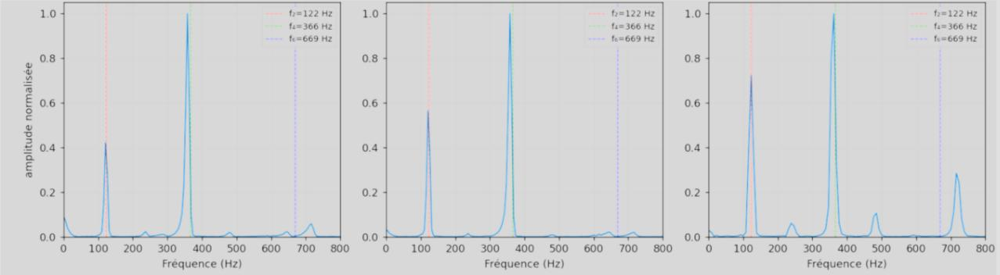
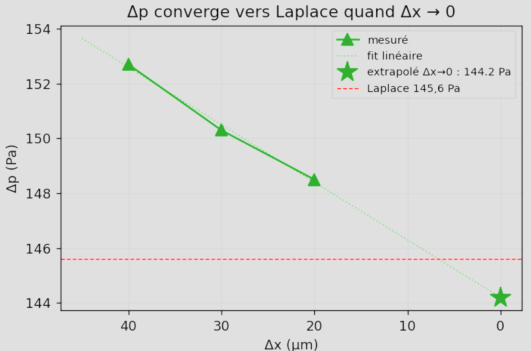
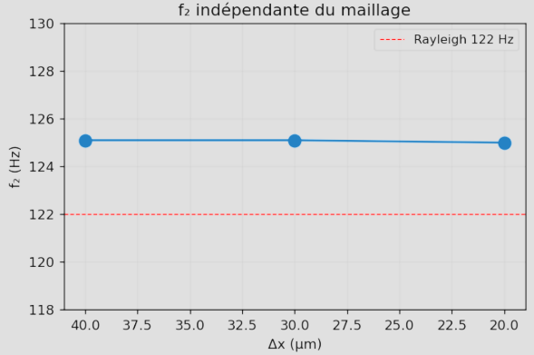
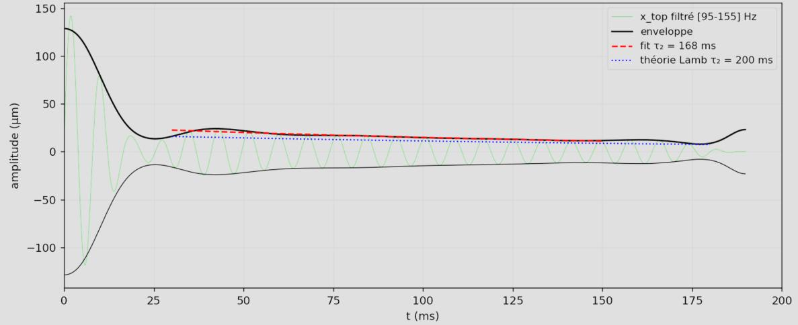
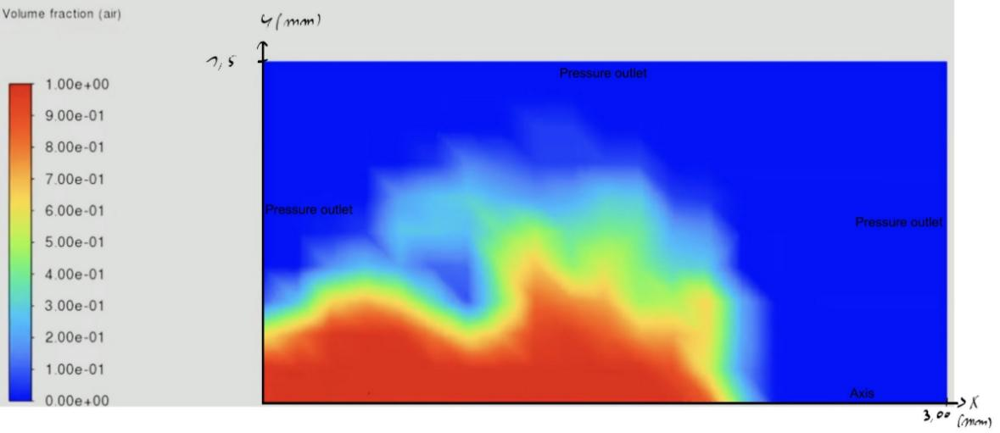
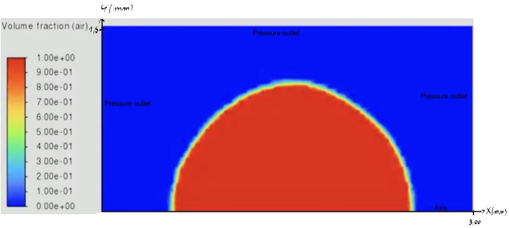
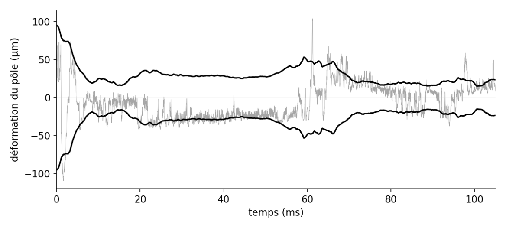

# Capillary oscillations of a droplet and a bubble — VOF simulation in Ansys Fluent

Research internship (Master 1 Physics, computational track), LPTM laboratory, CY Cergy Paris Université, April–June 2026.
Supervisor: Prof. Christophe Oguey.

**Goal:** validate a two-phase VOF–CSF simulation against exact analytical results (Laplace law, Rayleigh–Lamb theory), then test it on a numerically harder case: an air bubble in water.

## Setup
- Ansys Fluent 2025 R2 (student license), 2D axisymmetric, water/air, R = 1 mm, no gravity.
- VOF with geometric interface reconstruction (Geo-Reconstruct / PLIC), sharp interface, CSF surface tension model with implicit body force.
- PISO pressure–velocity coupling, PRESTO! pressure interpolation, second-order upwind momentum, first-order implicit time integration.
- Uniform Cartesian mesh Δx = 20 µm (R/Δx = 50); adaptive time step bounded by the capillary (Brackbill) criterion, Δt ≈ 2.5 µs.
- Bubble case: two-level adaptive mesh refinement 80 → 40 → 20 µm at the interface, re-adapted every 20 time steps.

## Validation on the water droplet

| Quantity | Theory | Simulation |
|---|---|---|
| Laplace pressure jump Δp | 145.6 Pa | 148.5 Pa (2 %); 144.2 Pa extrapolated to Δx → 0 (≈1 %) |
| Fundamental mode f₂ (n = 2) | 122 Hz | 125 Hz, mesh-independent over Δx = 20–40 µm |
| Mode f₄ (n = 4) | 366 Hz | 358 Hz (2 %) |
| Viscous damping time τ₂ | 200 ms | 168 ms (symmetric case); bracketed in 120–250 ms across meshes |
| Mass conservation | — | error < 0.001 % |

Post-processing in Python (NumPy / SciPy): resampling of the adaptive-time-step signals, FFT, Butterworth band-pass filtering, Hilbert envelope and exponential fit of the damping.

## The air bubble: a limit case
On a uniform mesh the bubble is destroyed by spurious currents within milliseconds. Adaptive mesh refinement stabilizes it (volume conserved, sharp interface, 105 ms without drift), but the capillary mode predicted at 149 Hz stays buried under spurious currents, which the light gas inside the bubble barely damps. A coupled level-set/VOF (CLSVOF) approach was also tested; in this Fluent version it diverged with adaptive refinement and was too diffusive on uniform meshes.

**Uniform mesh (167 µm): the bubble breaks up within milliseconds**

**Adaptive mesh (80 → 40 → 20 µm): the bubble stays stable**

## Known limitations
- Frequency resolution: with a 200 ms window the FFT bin is 5 Hz, so the 125 Hz vs 122 Hz difference is at the resolution limit; a sinusoidal fit would give a sharper estimate.
- The damping time is bracketed rather than measured: the simulated window covers only about one damping time.
- 2D axisymmetric, laminar, small meshes (about 11,000 cells for the droplet).

## Documents
- Full report (French): [internship_report_fr.pdf](internship_report_fr.pdf)
- Defense slides (French): [defense_slides_fr.pdf](defense_slides_fr.pdf)
- Volume-fraction animations: [Google Drive](https://drive.google.com/drive/folders/1KhLZBN-xtAIAcujkYpo5hJV__akSPM4T?usp=sharing)

Fluent case and data files are not included.
